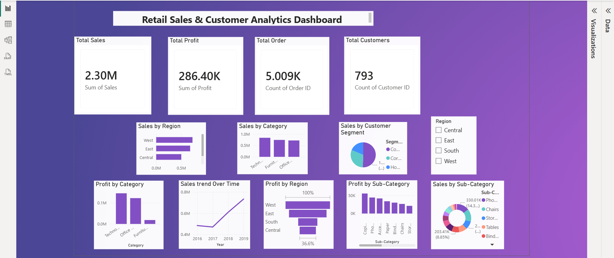

# Retail Sales & Customer Analytics Dashboard

## 📊 Project Overview

This project is an interactive Retail Sales & Customer Analytics Dashboard built using Microsoft Power BI.

The dashboard helps analyze retail sales performance, profitability, customer segments, regions, categories, and sub-categories through interactive visualizations.

## 🎯 Objectives

- Analyze total sales and profit
- Understand sales performance by region
- Compare sales across product categories
- Analyze customer segments
- Identify profitable categories and sub-categories
- Track sales trends over time
- Provide an interactive dashboard using slicers

## 🛠️ Tools & Technologies

- Microsoft Power BI
- Power Query
- DAX
- Data Visualization
- Data Analysis

## 📌 Key Dashboard Features

### KPI Metrics
- Total Sales
- Total Profit
- Total Orders
- Total Customers

### Visualizations
- Sales by Region
- Sales by Category
- Sales by Customer Segment
- Sales by Sub-Category
- Profit by Category
- Profit by Region
- Profit by Sub-Category
- Sales Trend Over Time

### Interactive Feature
- Region Slicer for filtering dashboard results

## 📈 Key Insights

The dashboard provides a clear view of:

- Overall sales and profit performance
- Regional sales differences
- Category-wise sales and profitability
- Customer segment contribution
- Sub-category performance
- Sales growth trends over time

## 🖼️ Dashboard Preview

## 📂 Project Files

- `Retail management & Customer analysis dashboard.pbix` — Power BI dashboard file
- `dashboard.png` — Final dashboard screenshot
- `README.md` — Project documentation

## 👩‍💻 Project Type

Data Analytics / Business Intelligence Project

## 🚀 Conclusion

This project demonstrates the use of Power BI to transform retail data into an interactive and meaningful business analytics dashboard.
